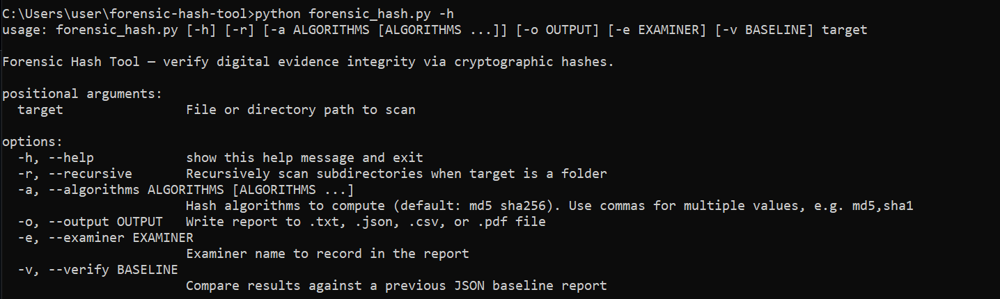
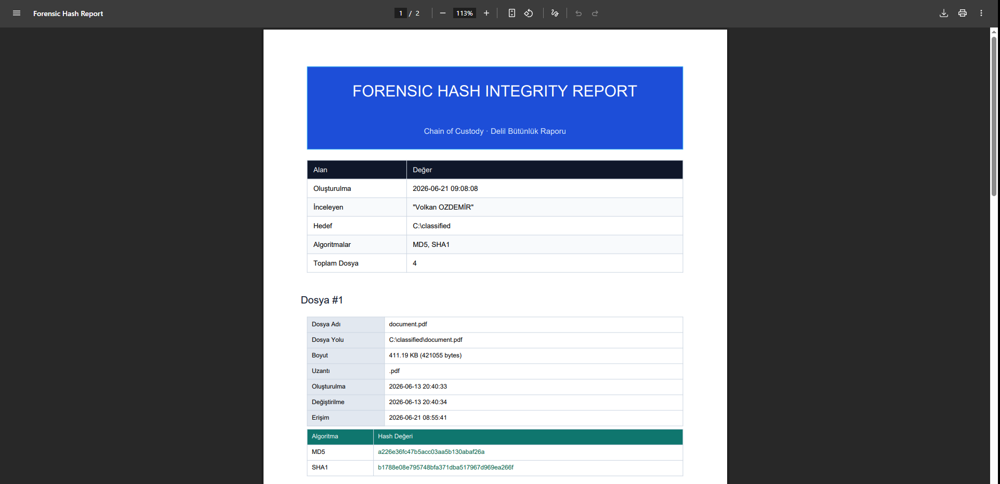
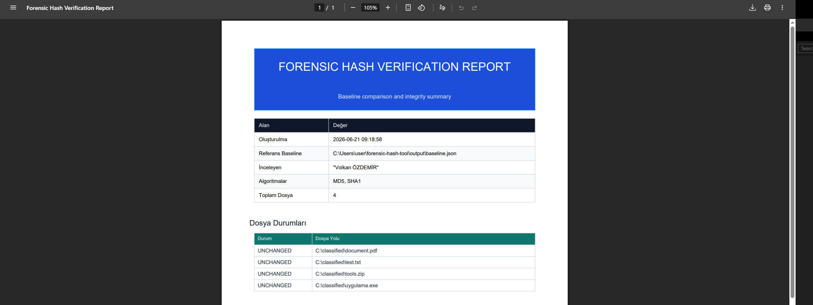

# Forensic Hash Tool

Forensic Hash Tool, adli bilişim incelemelerinde delil dosyalarının bütünlüğünü güvenilir biçimde doğrulamak için geliştirilmiş hafif bir Python CLI aracıdır.

## Neden bu araç?

- Dosyalarınızın hash değerlerini tek seferde birden fazla algoritmayla hesaplar.
- Dosya meta bilgilerini rapora ekler (boyut, uzantı, tarih bilgileri).
- Raporları `.txt`, `.json`, `.csv` ve `.pdf` formatlarında kaydeder.
- Mevcut bir JSON baseline ile karşılaştırma yaparak değişiklik tespitini yapar.
- Rapor çıktıları, proje kök dizininde otomatik olarak oluşturulan `output/` klasörüne yazılır.

## Özellikler

- `md5`, `sha1`, `sha256`, `sha512` algoritma desteği
- Klasör taraması ve alt dizin taraması (`-r`)
- Çoklu algoritma seçimi
- Rapor formatı otomatik algılama: `.txt`, `.json`, `.csv`, `.pdf`
- Baseline doğrulama ve güncelleme
- `examiner` parametresi isteğe bağlıdır, girildiğinde raporda gösterilir

## Kurulum

1. Depoyu klonlayın `git clone https://github.com/wolkansec/forensic_hash` veya zipten çıkarın.
2. `forensic_hash.py` dosyasını kullanarak rapor oluşturun.

## Hızlı Başlangıç

### Klasör taraması ve rapor üretme

```bash
python forensic_hash.py [TARGET_DIRECTORY] -r -a md5,sha256 -o report.pdf
```

`report.pdf` dosyası proje dizininde değil, otomatik olarak `output/report.pdf` olarak üretilir.

### Sadece tek dosya tarama

```bash
python forensic_hash.py [TARGET_DIRECTORY/FILE] -a sha512 -o report.txt
```

### Baseline oluşturma

```bash
python forensic_hash.py [TARGET_DIRECTORY] -r -a sha256 -o baseline.json
```

### Baseline doğrulama ve rapor üretme

```bash
python forensic_hash.py [TARGET_DIRECTORY] -r -a md5 -v baseline.json -o verify_report.pdf
```

### İnceleyen bilgisi ekleme (opsiyonel)

```bash
python forensic_hash.py [TARGET_DIRECTORY/FILE] -a md5 -e wolkansec -o report.txt
```

## Kullanım

```bash
python forensic_hash.py <target> [-r] [-a ALGORITHMS] [-o OUTPUT] [-e EXAMINER] [-v BASELINE]
```

### Parametreler

- `target`: Taranacak dosya veya klasör yolu (zorunlu)
- `-r`, `--recursive`: Hedef bir klasör ise alt dizinleri de tarar
- `-a`, `--algorithms`: Hesaplanacak hash algoritmaları. Örnek: `md5 sha1` veya `md5,sha1`
- `-o`, `--output`: Çıktının kaydedileceği dosya yolunu belirtir. Göreceli path verilirse `output/` klasöründe oluşturulur.
- `-e`, `--examiner`: İnceleyen adı. Bu parametre opsiyoneldir.
- `-v`, `--verify`: Önceki JSON baseline dosyasıyla karşılaştırma yapar.

## Rapor Formatları


- `.txt`  : Okunabilir metin raporu
- `.json` : Yapılandırılmış JSON raporu
- `.csv`  : Tablo formatı
- `.pdf`  : PDF raporu

> Not: PDF raporu oluşturmak için `reportlab` paketinin yüklü olması gerekir. Bunun için proje dizini içerisinde `pip install -r requirements.txt` komutunu çalıştırabilirsiniz. 

## Doğrulama (Verify)

`-v baseline.json` ile araç, mevcut tarama sonuçlarını verilen baseline JSON ile karşılaştırır. Değişiklik varsa farklar raporda listelenir.

- Yeni dosyalar `NEW`
- Silinen dosyalar `REMOVED`
- Değişen dosyalar `MODIFIED`
- Değişmeyen dosyalar `UNCHANGED`

Doğrulama raporu üretildiğinde baseline dosyası başarılı bir şekilde güncellenir ve eski baseline dosyası yedeklenir.

## Örnek Komutlar

```bash
python forensic_hash.py [TARGET_DIRECTORY/FILE] -a md5 -o report.txt
python forensic_hash.py [TARGET_DIRECTORY/FILE] -a sha256,sha512 -o hashes.csv
python forensic_hash.py [TARGET_DIRECTORY] -r -a sha256 -v baseline.json -o verify_report.pdf
python forensic_hash.py [TARGET_DIRECTORY/FILE] -a md5 -e "Volkan ÖZDEMİR" -o report.pdf
```
